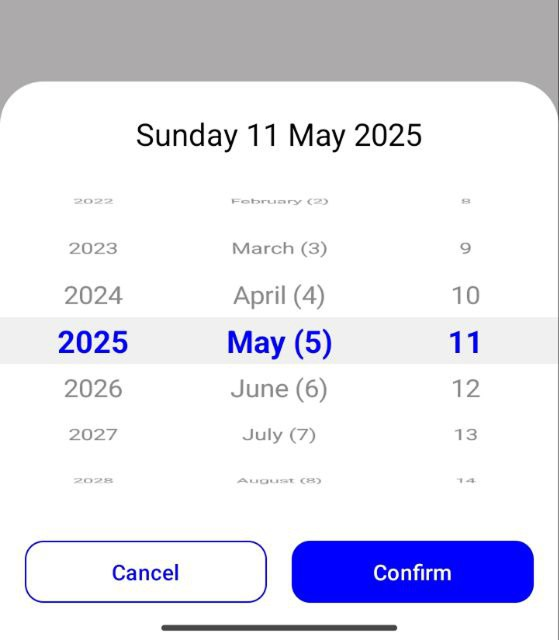
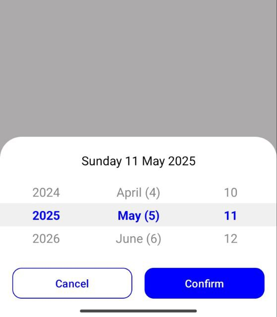
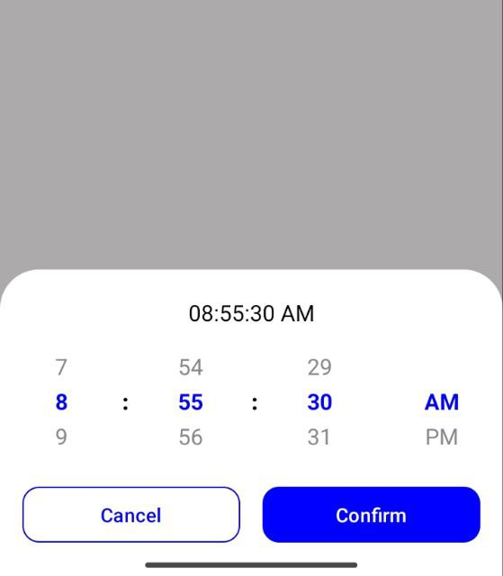
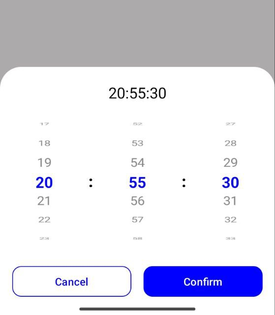

# 📅 Zamanak Calendar Library - Date Picker Module
**Latest Version:** [](https://jitpack.io/#SeyyedAliTabatabaei/ZamanakCalendar)

**License:** [Apache 2.0](https://opensource.org/licenses/Apache-2.0)  

## Screen Shots
<p align="center">
  
  
  
  
</p>

## Introduction
`compose-ui-date-picker` is a modern, flexible, and fully customizable date and time picker built with Jetpack Compose, designed to support **Jalali (Persian)**, **Hijri (Islamic)**, and **Gregorian** calendars. It works seamlessly with the zamanak-calendar-core module.

✨ Features
-	Elegant and user-friendly **date & time selection UI**
-	Supports **Jalali**, **Hijri**, and **Gregorian** calendar systems
-	Built entirely using **Jetpack Compose**
-	Fully **customizable appearance** to match your app’s theme
-	Easy integration with Compose State, ViewModel, or remember patterns
-	Localized texts and labels for better UX


## Installation
To add this library to your project, first, add the following settings to your `settings.gradle` file:
```groovy
dependencyResolutionManagement {
    repositoriesMode.set(RepositoriesMode.FAIL_ON_PROJECT_REPOS)
    repositories {
        mavenCentral()
        maven { url 'https://jitpack.io' }
    }
}
```

Then, add the library to your project dependencies:
```groovy
dependencies {
    implementation 'com.github.SeyyedAliTabatabaei.ZamanakCalendar:compose-ui-date-picker:[Latest Version]'
}
```

## Usage - Time Picker
```kotlin
// Time Picker
ZamanakTimePicker(
    config = ZamanakTimePickerConfig(
        is24HourFormat = false,
        defaultClock = Clock(10, 30, 0)
    )
) {  selectedClock ->
    // Handle selected time (Clock object with hour, minute, second)
    Log.i("TAG", "Selected time: $selectedClock")
}

// Time Picker shown as a Bottom Sheet Dialog
var isShowBottomSheet by remember { mutableStateOf(false) }
if (isShowBottomSheet) {
    ZamanakTimePickerBottomSheet(
        config = ZamanakTimePickerConfig(
            defaultClock = Clock(20 , 55 , 30) ,
            focusBackground = null ,
        ),
        onDismissBottomSheet = { isShowBottomSheet = false } ,
        onConfirm = {  selectedClock ->
            // Handle selected time (Clock object with hour, minute, second)
            Log.i("TAG", "Selected time: $selectedClock")
        }
    )
}
```

## Methods and Features
### ZamanakTimePicker Composable
| Parameter                         | Description                                                                   |
|-----------------------------------|-------------------------------------------------------------------------------|
| `config: ZamanakTimePickerConfig` | Configuration object to customize appearance and behavior of the time picker. |
| `timeSelected: (Clock) -> Unit`   | Callback invoked with the selected time whenever user changes it.             |


### ZamanakTimePickerConfig Class
| Property            | Description                                                         |
|---------------------|---------------------------------------------------------------------|
| `unfocusedCount`    | Number of unfocused items to show above and below the selected one. |
| `maxRotation`       | Max rotation angle for items in the picker.                         |
| `maxFontSize`       | Maximum font size for the selected item.                            |
| `minFontSize`       | Minimum font size for unfocused items.                              |
| `fontFamily`        | Font family used for text rendering.                                |
| `textColor`         | Color of unfocused text items.                                      |
| `textColorSelected` | Color of the selected item text.                                    |
| `itemHeight`        | Height of each item in the wheel.                                   |
| `showHourPicker`    | Whether to display the hour picker.                                 |
| `showMinutePicker`  | Whether to display the minute picker.                               |
| `showSecondPicker`  | Whether to display the second picker.                               |
| `is24HourFormat`    | Enables 24-hour format if set to true, otherwise shows AM/PM mode.  |
| `amText, pmText`    | Customizable labels for AM/PM.                                      |
| `defaultClock`      | Default time shown when the picker is first displayed.              |
| `focusBackground`   | Optional background shown behind the selected row (highlight).      |


---

<div align="left">
    <h2>📬 Contact Developer</h2>
    <p>
        ✉️ <a href="mailto:SeyyedAliTabatabaei7@gmail.com">Email</a> |
        💻 <a href="https://github.com/SeyyedAliTabatabaei">GitHub</a>
    </p>
    <p>
        
        
    </p>
</div>